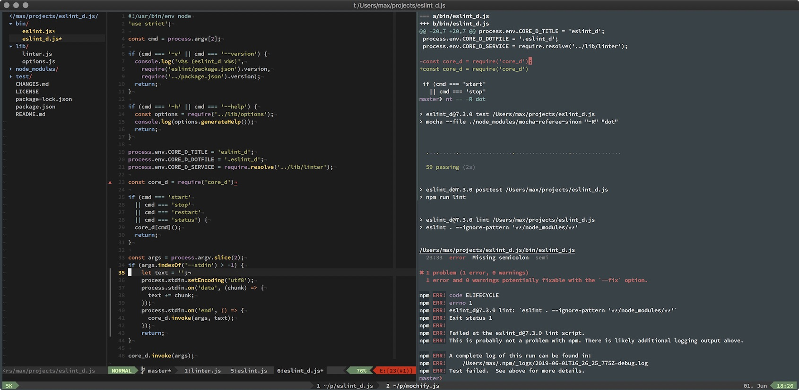

# Max' dotfiles

> This is my personal life saver. If you're looking for more inspiration, there
are great [dotfile suggestions from GitHub][dotfiles].



I've chosen to go with the bootstrap script from [@mathiasbynens][] and a bunch
of git submodules in `.vim/bundle`. The whole thing works by cloning this repo
into your projects folder and running the bootstrap script.

## Setup

[Homebrew][]:

```bash
/usr/bin/ruby -e "$(curl -fsSL https://raw.githubusercontent.com/Homebrew/install/master/install)"
brew install git
```

Dotfiles:

```bash
git clone git@github.com:mantoni/dotfiles.git
cd dotfiles
./bootstrap.sh
```

## Additional setup

[Brewfile][]:

```bash
# cd dotfiles
brew tap Homebrew/bundle
brew bundle
```

Global npm modules:

```bash
npm i -g eslint_d
npm i -g json
npm i -g diff-so-fancy
npm i -g dark-mode-cli
```

Tern:

```bash
cd ~/.vim/bundle/tern && npm install
```

## Environment specific config

My `.bash_profile` sources `.secrets` which is not checked into this
repository. This is where I keep things like `GIT_` configs and environment
specific aliases:

```bash
export GIT_AUTHOR_NAME='Maximilian Antoni'
export GIT_AUTHOR_EMAIL='...'
export GIT_COMMITTER_NAME=$GIT_AUTHOR_NAME
export GIT_COMMITTER_EMAIL=$GIT_AUTHOR_EMAIL
```

Or with `fish`:

```bash
set -gx GIT_AUTHOR_NAME 'Maximilian Antoni'
set -gx GIT_AUTHOR_EMAIL '...'
set -gx GIT_COMMITTER_NAME $GIT_AUTHOR_NAME
set -gx GIT_COMMITTER_EMAIL $GIT_AUTHOR_EMAIL
```

In case brew is not around and vim needs to be compiled:

```bash
$ ./configure --with-features=huge --enable-multibyte --enable-pythoninterp \
    --with-python-config-dir=/usr/local/lib/python2.7/config
```

## SSH config for macOS Sierra

`~/.ssh/config`:

```
IdentityFile ~/.ssh/id_rsa
AddKeysToAgent yes
```

## Homebrew

```bash
# UTF-8 support for less
brew install homebrew/dupes/less
# Fix clipboard on macOS Sierra
brew install reattach-to-user-namespace
```

## Updating

To update all submodules, run `./bootstrap --update`.

[dotfiles]: http://dotfiles.github.com
[@mathiasbynens]: https://github.com/mathiasbynens/dotfiles
[Homebrew]: https://brew.sh
[Brewfile]: https://github.com/Homebrew/homebrew-bundle
