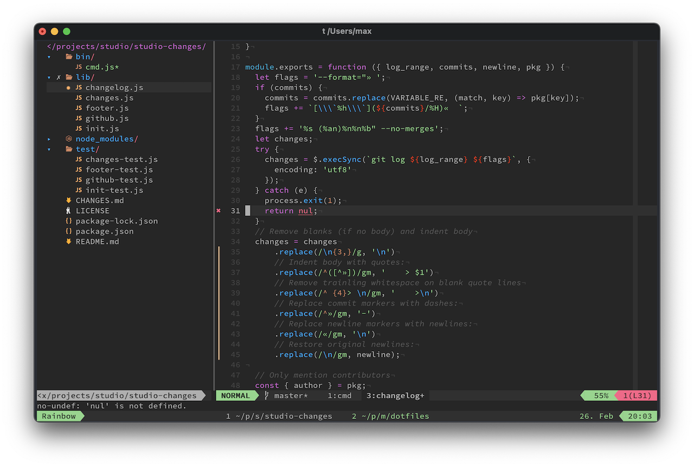

# Max' dotfiles

> This is my personal life saver. If you're looking for more inspiration, there
> are great [dotfile suggestions from GitHub][dotfiles].



I've chosen to go with the bootstrap script from [@mathiasbynens][] and a bunch
of git submodules in `.vim/pack`. The whole thing works by cloning this repo
into your projects folder and running the bootstrap script.

## Setup

**[Homebrew][]:**

```bash
/usr/bin/ruby -e "$(curl -fsSL https://raw.githubusercontent.com/Homebrew/install/master/install)"
```

**Dotfiles**:

```bash
git clone git@github.com:mantoni/dotfiles.git
cd dotfiles
./bootstrap.sh --update
./bootstrap.sh
```

**iTerm:**

Two profiles should be created called "Dark" and "Light" with "Dark" being the
default. If `dark-mode` is installed (see npm modules), the "Light" profile is
loaded when Mac OS X dark mode is turned off.

## Additional setup

Making fish the default shell:

```bash
echo "/usr/local/bin/fish" | sudo tee -a /etc/shells
chsh -s `which fish`
```

Enable italic fonts in iTerm:

```bash
tic -o ~/.terminfo xterm-256color.terminfo
```

Global npm modules:

```bash
npm i -g eslint_d
npm i -g json
npm i -g diff-so-fancy
npm i -g dark-mode-cli
```

## Homebrew

```bash
# UTF-8 support for less
brew install homebrew/dupes/less
```

## Updating

To update all submodules, run `./bootstrap --update`.

[dotfiles]: http://dotfiles.github.com
[@mathiasbynens]: https://github.com/mathiasbynens/dotfiles
[homebrew]: https://brew.sh
[brewfile]: https://github.com/Homebrew/homebrew-bundle
